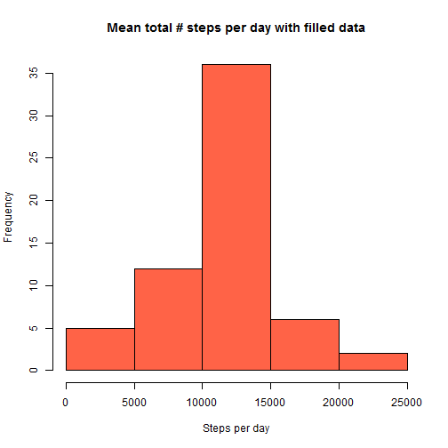

**Question 1** 
What is mean total number of steps taken per day? 
For this part of the assignment, you can ignore the missing values in the dataset. 
Calculate the total number of steps taken per day
Make a histogram of the total number of steps taken each day 
Calculate and report the mean and median of the total number of steps taken per day


```r
require(ggplot2)
# read in data
data = read.csv('activity.csv', header = T)
# calculate total steps per day
totstepsday = tapply(data$steps, data$date, sum, na.rm=T)
# make plots and print out mean/median values
hist(totstepsday, main='Mean total number of steps per day', ylab = 'Frequency',
     xlab = 'Steps per day', col = 'tomato')
```

 

```r
print(paste('Mean total steps per day is: ', as.character(mean(totstepsday))))
```

```
## [1] "Mean total steps per day is:  9354.22950819672"
```

```r
print(paste('Median total steps per day is: ', as.character(median(totstepsday))))
```

```
## [1] "Median total steps per day is:  10395"
```

**Question 2** 
What is the average daily activity pattern? 
Make a time series plot (i.e. type = "l") of the 5-minute interval (x-axis) and 
the average number of steps taken, averaged across all days (y-axis)
Which 5-minute interval, on average across all the days in the dataset, contains the maximum number of steps?

**Answer:** As shown below the time interval with the most steps is 8:35 AM.

```r
# calculate mean 
meanstepsintrvl = tapply(data$steps, data$interval, mean, na.rm=T)
# vector of time steps
ts = unique(data$interval)
# plot time series
plot(ts, meanstepsintrvl, type='l', lwd = 1.5, xlab = 'Time (HHMM)',
     ylab = 'Mean number of steps', col = 'red3', main='Mean daily activity pattern')
```

 

```r
# determine time interval with most steps
result = as.character(ts[which(meanstepsintrvl == max(meanstepsintrvl))])
print(paste('Time interval with the most steps is ',substring(result,1,1),':',
            substring(result,2,3),sep=''))
```

```
## [1] "Time interval with the most steps is 8:35"
```
  
**Question 3** 
Imputing missing values 
Note that there are a number of days/intervals where there are missing values 
(coded as NA). The presence of missing days may introduce bias into some 
calculations or summaries of the data. Calculate and report the total number 
of missing values in the dataset (i.e. the total number of rows with NAs)
Devise a strategy for filling in all of the missing values in the dataset. The 
strategy does not need to be sophisticated. For example, you could use the mean/
median for that day, or the mean for that 5-minute interval, etc.
Create a new dataset that is equal to the original dataset but with the missing data filled in.
Make a histogram of the total number of steps taken each day and Calculate and 
report the mean and median total number of steps taken per day. Do these values 
differ from the estimates from the first part of the assignment? What is the 
impact of imputing missing data on the estimates of the total daily number of steps? 
  
**Answer:** Yes, imputing the missing data with average values does change the mean and median values. As it happens, the mean and median are the same after filling because of the number of days with no data at all.


```r
# Figure out where the NaNs are, make copy first
stepscopy = data$steps
nans = is.na(stepscopy)
# fill in the blanks
for (i in 1:length(nans)){
  # if a NaN, proceed
  if (nans[i] == T){
    # find mean # steps for that time interval, assign to "stepscopy"
    stepscopy[i] = meanstepsintrvl[which(ts == data$interval[i])]    
  }  
}
# make another histogram with filled data and recompute mean and median
totstepsdayfill = tapply(stepscopy, data$date, sum, na.rm=T)
hist(totstepsdayfill, main='Mean total # steps per day with filled data', ylab = 'Frequency',
     xlab = 'Steps per day', col = 'tomato')
```

 

```r
print(paste('Mean total steps per day of filled data is: ', as.character(mean(totstepsdayfill))))
```

```
## [1] "Mean total steps per day of filled data is:  10766.1886792453"
```

```r
print(paste('Median total steps per day of filled data is: ', as.character(median(totstepsdayfill))))
```

```
## [1] "Median total steps per day of filled data is:  10766.1886792453"
```
  
  
**Question 4** 
Are there differences in activity patterns between weekdays and weekends? 
For this part the weekdays() function may be of some help here. Use the dataset with the filled-in
missing values for this part. Create a new factor variable in the dataset with two levels - 
"weekday" and "weekend" indicating whether a given date is a weekday or weekend day. 
Make a panel plot containing a time series plot (i.e. type = "l") of the 5-minute interval (x-axis)
and the average number of steps taken, averaged across all weekday days or weekend days (y-axis). 
See the README file in the GitHub repository to see an example of what this plot should look like 
using simulated data.  
  
  
**Answer:** Yes, there are differences between the weekends and weekdays. There is less activity in the mornings on the weekends.


```r
# make factor variable for weekend
dayofweek = weekdays(as.Date(data$date))
weekends = character(length = length(dayofweek))
# make factor list of weekends and weekdays
for (i in 1:length(dayofweek)){
  {if (dayofweek[i] == 'Sunday' | dayofweek[i] == 'Saturday'){
    weekends[i] = 'weekend'}
   else{
     weekends[i] = 'weekday'
   }
  }
}
weekends = as.factor(weekends)
# column bind filled data and weekends factor variable
data2 = cbind(data,stepscopy, weekends)
wkend = data2[weekends == 'weekend',]
wkday = data2[weekends == 'weekday',]
# average across weekdays and weekend days
wkendintrvl = tapply(wkend$stepscopy, wkend$interval, mean, na.rm=T)
wkdayintrvl = tapply(wkday$stepscopy, wkday$interval, mean, na.rm=T)
# make into data frame
paneldata = data.frame(interval=ts,steps = wkendintrvl, dayofweek = wkend$weekends[1:288])
paneldata = rbind(paneldata, data.frame(interval=ts,steps = wkdayintrvl, dayofweek = wkday$weekends[1:288]))
# make panel plot
qplot(interval, steps, data = paneldata, facets = dayofweek~., geom="line",
      xlab = 'Interval', ylab = "Number of steps")
```

 
